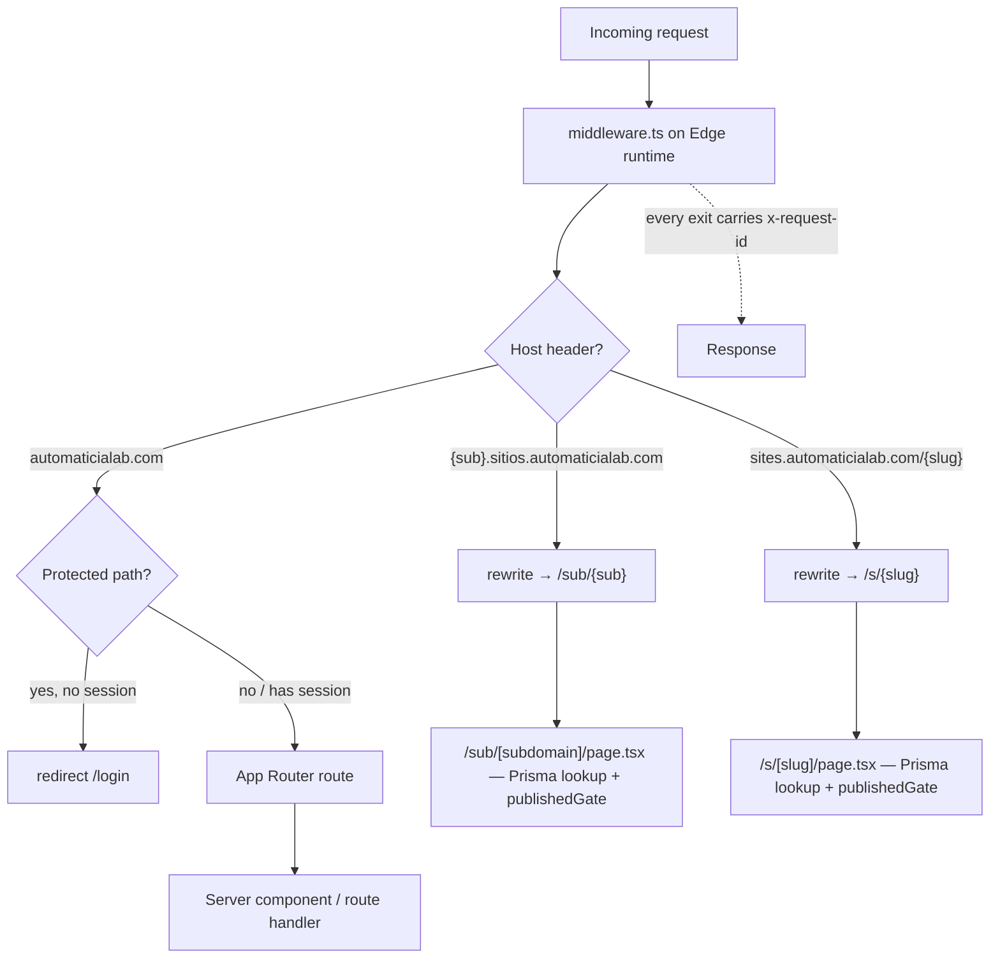

# 1. Architecture

## Contents
- [Stack](#stack)
- [Request flow](#request-flow)
- [Multi-tenancy: how a host becomes a site](#multi-tenancy-how-a-host-becomes-a-site)
- [The published-site gate](#the-published-site-gate)
- [The database is SHARED with JurisArgentina](#the-database-is-shared-with-jurisargentina)
- [Startup validation](#startup-validation)

## Stack

| Layer | Choice | Where |
|---|---|---|
| Framework | Next.js `14.2.5`, App Router | `package.json`, `app/` |
| Language | TypeScript 5 (build fails on type error) | `next.config.js` → `typescript.ignoreBuildErrors: false` |
| ORM | Prisma 5 | `prisma/schema.prisma`, `lib/prisma.ts` |
| DB | PostgreSQL | `datasource db` in `prisma/schema.prisma` |
| Auth | NextAuth 4 (JWT sessions) | `lib/auth.ts` |
| Styling | Tailwind + Radix + Zustand store | `tailwind.config.ts`, `store/` |
| Payments | MercadoPago (preapproval subscriptions) | `app/api/mp/*`, `lib/website-plans.ts` |

The app is one Next.js server. It hosts three surfaces:

1. The **marketing site** and **dashboard** (`automaticialab.com`) — the wizard, editor, admin, and 13 products.
2. The **published client sites** served on two other host shapes (below).
3. The **API** under `app/api/*`, including the MercadoPago webhook and the cron endpoint.

## Request flow



**Middleware runs on the Edge runtime** (`middleware.ts`), so it must not touch
Prisma or Node built-ins. It does only three things:

1. **Correlation id** — `resolveRequestId()` (`lib/request-id.ts`) adopts a valid inbound `x-request-id` or mints one, and every response leaving `middleware()` carries it back. See [doc 4 → Observability](./04-deployment-operations.md#observability).
2. **Site routing** — parses the `Host` header and rewrites to the internal site routes (below). Host parsing only; the DB lookup happens in the rewritten route, off the Edge.
3. **Auth gate** — for `PROTECTED_PATHS` (dashboard, projects, wizard, admin, and the other products) it checks the NextAuth JWT via `getToken()` and redirects to `/login` when absent.

`middleware.ts` `config.matcher` excludes `_next/static`, `_next/image`, and `favicon.ico`.

## Multi-tenancy: how a host becomes a site

A published project is reachable through **two addressing modes**, both defined
in `lib/site-domain.ts` (Edge-safe: no Prisma):

| Mode | Host shape | Middleware rewrite | Route |
|---|---|---|---|
| Subdomain | `{sub}.sitios.automaticialab.com` | `/sub/{sub}` | `app/sub/[subdomain]/page.tsx` |
| Path | `sites.automaticialab.com/{slug}` | `/s/{slug}` | `app/s/[slug]/page.tsx` |

- `extractSiteSubdomain(host)` normalizes the host (strips `:port`, lowercases, strips a trailing dot), then requires a single RFC-1123 label that is not reserved (`lib/subdomain.ts`). It deliberately **rejects multi-level hosts** (`a.b.sitios...`) — the wildcard TLS cert covers exactly one level.
- `isSitesPathHost(host)` matches `sites.automaticialab.com` (and `www.`) exactly, replacing an older `startsWith` check that would have matched `sites.automaticialab.com.evil.tld`.
- The bases are read from `NEXT_PUBLIC_SITES_DOMAIN` / `NEXT_PUBLIC_SITES_SUBDOMAIN_BASE` (build-time inlined). Outside production, `{sub}.localhost` and `{sub}.lvh.me` are also accepted for local testing.

`robots.txt` is special-cased in `middleware.ts`: on a subdomain host, `/robots.txt` is site-owned and rewrites through to `/sub/{sub}/robots.txt` (a client subdomain root belongs to that one client). On the shared path host the root belongs to the platform, so only `/{slug}/robots.txt` reaches a site.

The canonical URL of a project is `publishedSiteUrl(project)` — **subdomain wins when set**, otherwise the path URL.

## The published-site gate

`publishedGate()` in `lib/published-site.ts` is the single source of truth for
"may this site be served?". It is defined **once** and used by both addressing
modes, because a parallel gate is exactly how one mode ends up serving a site the
other refuses.

```ts
// lib/published-site.ts
function publishedGate(now = new Date()) {
  return {
    status: 'published',
    hasPaid: true,
    OR: [
      { billingStatus: 'active' },
      { billingStatus: 'grace', graceUntil: { gt: now } },
    ],
  }
}
```

Three independent conditions, all required:

- `status: 'published'` — the owner published it (set only by `POST /api/projects/[id]/publish`).
- `hasPaid: true` — a payment ever completed (written only by the MercadoPago webhook).
- billing is `active`, **or** `grace` with a still-open `graceUntil`.

The grace branch is **time-dependent and evaluated at read time**: a project
whose `graceUntil` has passed is excluded by the `> now` predicate on every
query, so an elapsed grace period takes the site down with no scheduler
involved. This same read-time principle recurs everywhere (see
`effectiveBillingStatus()` in `lib/project-billing.ts`, [doc 3](./03-billing-mercadopago.md)).

Both public loaders (`findPublishedProjectBySlug`, `findPublishedProjectBySubdomain`)
spread `...publishedGate()` into a single `findFirst`, so an unpaid or suspended
site is indistinguishable from a nonexistent one (404 either way).

## The database is SHARED with JurisArgentina

**Critical for anyone running migrations against production.** This app's
PostgreSQL database is **shared** with the JurisArgentina project. That project
owns tables that are **not in `prisma/schema.prisma`** — notably `fallos` and
`import_stats`.

Consequence: a `prisma migrate diff` against production will report `fallos` and
`import_stats` as **"extra" tables** relative to this schema. **That is expected
and they must NOT be dropped.** Never run `prisma db push` (which would try to
reconcile them away) against production — see the standing rule in
[`docs/deploy/prisma-migration-reconciliation.md`](./deploy/prisma-migration-reconciliation.md).
Prisma only manages the tables it declares; it does not drop unknown tables on
`migrate deploy`, which is why `migrate deploy` (not `db push`) is the container
`CMD`.

> ⚠️ The exact set of JurisArgentina-owned tables beyond `fallos` /
> `import_stats` is not enumerable from this repo (they live in the other
> project's schema). Treat any table absent from `prisma/schema.prisma` as
> foreign and out of scope before dropping anything.

## Startup validation

`instrumentation.ts` runs once at server boot (Node runtime only). In
**production it aborts startup** if any *required* env var is missing or the
encryption key is too short; in development it only warns. The required set:
`NEXTAUTH_SECRET`, `DATABASE_URL`, `MP_ACCESS_TOKEN`, `MP_WEBHOOK_SECRET`,
`CREDENTIALS_ENCRYPTION_KEY`. A booting-but-broken container that silently drops
payments is the failure this guards against — full rationale in
[`docs/deploy/ENVIRONMENT.md`](./deploy/ENVIRONMENT.md).

Look for `[STARTUP] All required env vars validated OK` (or `[STARTUP ABORT] ...`)
in the container logs.
