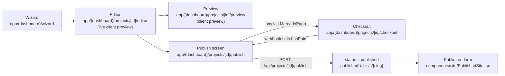

# 2. The website generator (the product)

The primary product: a self-service tool where a user builds a business website
through a wizard, edits it, previews it, and publishes it under a subdomain or a
path URL once they pay.

## Contents
- [Data model](#data-model)
- [The lifecycle: wizard → editor → preview → publish](#the-lifecycle-wizard--editor--preview--publish)
- [Subdomains: claim + reservation](#subdomains-claim--reservation)
- [The three renderers, and why they are separate](#the-three-renderers-and-why-they-are-separate)
- [Leads (the owner's inbox)](#leads-the-owners-inbox)
- [SEO tiers (the Professional differential)](#seo-tiers-the-professional-differential)

## Data model

A site is one `Project` row (`prisma/schema.prisma`). The heavy, variable-shape
content is stored as **JSON serialized into `String`/`TEXT` columns**, not as
relational tables:

| Column | Type | Holds |
|---|---|---|
| `businessData` | `String` (JSON) | The whole business: name, description, `contact`, `services`, `team`, `testimonials`, `faqs`, `stats`, `branding`, `seo`, `heroImage`, `gaId`, … (`types/`, `BusinessData`) |
| `sections` | `String` (JSON) | `SectionConfig[]` — which sections, their order, enabled state |
| `mediaIds` | `String` (JSON, default `"[]"`) | Media library ids used by the site |
| `slug` | `String` | Path-mode identifier (`/s/{slug}`) |
| `subdomain` | `String?` `@unique` | Subdomain-mode identifier, always lowercase, nullable |
| `status` | `String` (default `draft`) | `draft` / `generating` / `ready` / `error` / `published` |
| `plan` | `String` (default `free`) | `free` / `essential` / `professional` |
| `hasPaid`, `preapprovalId` | | Billing — see [doc 3](./03-billing-mercadopago.md) |
| `billingStatus`, `graceUntil`, `suspendedAt`, `suspendedReason` | | Billing lifecycle — see [doc 3](./03-billing-mercadopago.md) |
| `grantedBy`/`grantedAt`, `couponId`/`couponRedeemedAt` | | Provenance of a "paid" state — see [doc 5](./05-admin-operations.md) |
| `views` | `Int` (default 0) | Cumulative visit counter (no time dimension — see [doc 8](./08-known-issues.md)) |

Why JSON-in-TEXT: the section content is highly variable and edited as a whole
document, so a relational decomposition would buy nothing. The tolerant parser
`parseJSON()` (`lib/published-site.ts`) is used everywhere these columns are
read, so a single corrupt row degrades to a fallback and is logged rather than
500-ing an entire project list.

The serialization boundary is `lib/projectSerializer.ts`:
- `serializeProjectFromClient()` — strips everything outside `CLIENT_WRITABLE_FIELDS` before a request body reaches Prisma. This is the paywall boundary (see [Security](./06-security.md)).
- `serializeProject()` — trusted server use; accepts billing fields.
- `deserializeProject()` — resolves `billingStatus` through `effectiveBillingStatus()` (read-time grace expiry) and parses JSON columns tolerantly.

## The lifecycle: wizard → editor → preview → publish

- **Wizard** (`app/(dashboard)/wizard/page.tsx`) — collects business data into a new `Project`.
- **Editor** (`.../[id]/editor/page.tsx`) — visual editing; renders a **live client-side preview** of unsaved state.
- **Preview** (`.../[id]/preview/page.tsx`) — a second client preview.
- **Publish** (`.../[id]/publish/page.tsx`) — the paywall screen (client-side paywall is UX only; enforcement is server-side).
- **Publish endpoint** — `POST /api/projects/[id]/publish` is the **only** path to `status: 'published'`. It runs three server-side gates (ownership → `hasPaid` → not suspended, via `effectiveBillingStatus()`), then sets `status: 'published'` and `publishedUrl: /s/{slug}` (derived from the stored slug, never the request). See `app/api/projects/[id]/publish/route.ts`.

Project mutations go through `PUT /api/projects/[id]` → `serializeProjectFromClient()`.
`status` is **not** client-writable there; only the publish endpoint may grant
`published` (see [Security → paywall](./06-security.md)).

## Subdomains: claim + reservation

`lib/subdomain.ts` is the single validation entry point. A subdomain must:

- be 3–63 chars, `[a-z0-9-]` only, not start/end with `-`, no `--`;
- pass RFC-1123 label rules;
- not be in `RESERVED_SUBDOMAINS`.

Reservations cover web/protocol conventions (`www`, `api`, `admin`, `mail`, …)
**and the live sibling services on this VPS** (`siteai`, `mcp`, `evo`, `juris`,
`causas`, `turnos`, `n8n`, `easypanel`) — claiming one of those would hijack a
running service, so they are non-optional.

Storage is **always lowercase** (`normalizeSubdomain()`): PostgreSQL unique
indexes are case-sensitive, so normalization is the only thing stopping `Foo`
and `foo` from being two rows for the same host. The `Project.subdomain @unique`
constraint enforces one-owner-per-subdomain. On write, `sanitizeSubdomain()`
(in `projectSerializer.ts`) normalizes and validates server-side; an empty
string / null **releases** the subdomain (frees it — PostgreSQL allows many
NULLs under a unique index). Subdomains are plan-agnostic and nullable: free
projects keep the path URL.

`app/api/subdomains/` backs the availability check in the UI.

## The three renderers, and why they are separate

There are three places a site is drawn, and they are deliberately distinct:

1. **The published server component** — `components/site/PublishedSite.tsx`. It
   renders a **self-contained document with its own `<html>`/`<head>`** so a
   client site never inherits the dashboard shell's fonts, analytics, or chrome.
   Rendered by the public routes (`/sub/[subdomain]`, `/s/[slug]`) with the
   already-gated `Project`.
2 & 3. **Two client previews** — the editor's live preview and the standalone
   preview page. These show **unsaved state** as the owner edits, which a server
   component (which only sees persisted rows) cannot do.

To keep the three visually identical, the section bodies were extracted into
**shared section components** under `components/site/sections/`
(`HeroSection`, `ServicesSection`, `PricingSection`, `GallerySection`,
`AboutSection`, `TeamSection`, `TestimonialsSection`, `FaqSection`,
`ContactSection`, `StatsSection`, `CtaSection`, plus `types.ts`). All three
renderers compose these same components, so the preview and the published site
converge on one source of truth for each section's markup.

> The published↔preview convergence is treated as a product decision, not an
> accident — see [doc 8](./08-known-issues.md).

**The honesty rule in rendering** (`PublishedSite.tsx`): a section renders
**only when the owner actually supplied its content** (`dataReady()` predicate).
An empty section is omitted, never back-filled with invented services, sample
pricing, placeholder gallery tiles, or stock figures. Pricing renders only when
at least one service has a real `price` — the "—" price card the preview mock
uses is never emitted on a live site. Nav links, footer links, and section ids
all read the same `dataReady`/`NAV_META` source so a nav link can never point at
an omitted anchor. See [Security → the honesty rule](./06-security.md).

## Leads (the owner's inbox)

A published site's contact form captures leads that belong to **that project's
owner**, never the platform. This is a separate flow from the agency's own sales
funnel (`Inquiry`).

- **Model:** `SiteLead` (`prisma/schema.prisma`) — `projectId` FK, `name`, `email`, `phone`, `message`, `status` (`new`/`read`/`archived`), `ipAddress`, `userAgent`. Indexed `[projectId, createdAt]` for newest-first owner reads.
- **Capture:** `POST /api/site-leads` (`app/api/site-leads/route.ts`). Zod-validated, honeypot anti-spam (a filled honeypot returns a fake 200 and stores nothing), rate-limited 5 per 10 min per IP. It **only accepts leads for a live site** (`status: 'published', hasPaid: true`). The lead is **persisted first** — storage defines success — then a notification email is fired to the site owner (public contact email, falling back to account email); a mail failure never fails the capture.
- **Inbox:** `/projects/[id]/leads` (`app/(dashboard)/projects/[id]/leads/`). Backed by `GET/PATCH /api/projects/[id]/leads` and `/[leadId]`. Shared vocabulary and pagination in `lib/site-leads.ts` (`SITE_LEADS_PAGE_SIZE = 25`, `clampLeadsPage()` guards against deep-offset scans). `ipAddress`/`userAgent` are captured for abuse triage but deliberately **not** sent to the owner's dashboard — they are the visitor's data.

The unread badge in the dashboard comes from `_count.siteLeads` (filtered on
`status: 'new'`), surfaced as `unreadLeads` by `deserializeProject()`; it is left
`undefined` (not `0`) when a response didn't measure it, so "no unread" is
distinguishable from "not counted".

## SEO tiers (the Professional differential)

SEO output lives in `lib/site-seo.ts` (pure — no Prisma) and
`lib/published-site.ts` (metadata + sitemap + robots). Two tiers:

| Feature | Tier | Where |
|---|---|---|
| `keywords`, title, description | **Every paid site** (not plan-gated) | `parseSeoKeywords()`, `buildPublishedSiteMetadata()` |
| `sitemap.xml` | Every paid site, gated on `seo.sitemapEnabled` + `hasPaid` (never plan) | `publishedSiteSitemapResponse()` |
| OpenGraph / Twitter **image** card | **Professional only** | `hasProfessionalSeo()` gate in `buildPublishedSiteMetadata()` |
| LocalBusiness **JSON-LD** | **Professional only** | `buildSiteStructuredData()` + `PublishedSite.tsx` |
| Own `robots.txt` pointing at the sitemap | **Professional only** | `publishedSiteRobotsResponse()`, `app/{sub,s}/**/robots.txt/route.ts` |
| Google Analytics (`gaId`) | **Professional only** | `PublishedSite.tsx` — gated on `row.plan === 'professional'` |

`hasProfessionalSeo()` reads `plan === 'professional' && hasPaid === true` off
the **project row** (server-side). `plan` is absent from `CLIENT_WRITABLE_FIELDS`,
so a crafted request body cannot escalate into paid-tier markup.

The JSON-LD builder follows the **honesty rule** strictly: it emits only fields
the owner actually supplied and deliberately **never** emits `aggregateRating`,
`review`, `openingHours`, `geo`, or `priceRange` (this product has no review
verification, and the other fields aren't collected as structured input). See
the module header of `lib/site-seo.ts` for the full rationale. `serializeJsonLd()`
escapes `<`, U+2028, U+2029 to prevent a business name from breaking out of the
`<script>` element.

> Historical note (from the code comments): the plan feature lists in
> `lib/website-plans.ts` were corrected so every advertised line names something
> the code does — except **"Soporte prioritario"**, kept deliberately as a human
> commitment with no code behind it. See [doc 8](./08-known-issues.md).
