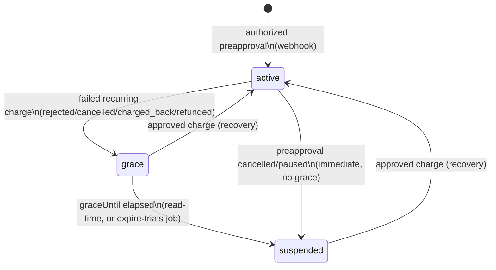

# 3. Billing & MercadoPago

> ⚠️ **PENDING — BLOCKING BEFORE THE FIRST REAL CUSTOMER.** The MercadoPago
> integration has **never been tested against the real MercadoPago API.** Run a
> full **sandbox subscription** end-to-end (create preapproval → authorized
> webhook → a recurring charge → a failed charge → a cancellation) before
> onboarding a paying customer. Nothing below has been exercised against live
> MP. This is the single most important open item — see [doc 8](./08-known-issues.md).
>
> **Level 1 (our-side) is now automated** in `tests/mp-webhook-flow.test.ts` — the
> webhook state machine, idempotency, and signature self-consistency. That **does
> not close this blocker**: it proves our half only, never that our signed payloads
> and assumed MP shapes match real MercadoPago. See
> [Testing levels](#testing-levels-what-level-1-proves-what-it-does-not).

## Contents
- [Plans (single source of truth for prices)](#plans-single-source-of-truth-for-prices)
- [The subscription / preapproval flow](#the-subscription--preapproval-flow)
- [The webhook](#the-webhook)
- [Testing levels: what Level 1 proves, what it does not](#testing-levels-what-level-1-proves-what-it-does-not)
- [The billing lifecycle](#the-billing-lifecycle)
- [Recurring charges: grace and suspension](#recurring-charges-grace-and-suspension)
- [Coupons](#coupons)
- [The plan-id prototype-pollution guard](#the-plan-id-prototype-pollution-guard)

## Plans (single source of truth for prices)

`lib/website-plans.ts` is the **only** place website-plan prices are defined.
MercadoPago charges exactly what this module emits — the price must never be
duplicated at a call site.

| Plan id | Monthly (ARS) | Annual (ARS/mo) | maxProjects |
|---|---|---|---|
| `essential` | 19000 | 11400 | 1 |
| `professional` | 29000 | 17400 | 3 |

`WEBSITE_PLAN_IDS = ['essential', 'professional']` is the source of truth;
`WebsitePlanId` is derived from it so the list and the type can't drift.
`websitePlanPrice(planId, annual)` returns the amount; a client **never** sends
a price — only a plan id, re-validated server-side against this config.

(The twelve subscription products each have their own `lib/*-plans.ts` — e.g.
`monitoreo-plans.ts`, `causas-plans.ts` — following the same pattern.)

## The subscription / preapproval flow

MercadoPago subscriptions use **preapprovals** (recurring authorizations). The
`app/api/mp/create-*` route handlers open a preapproval with an
`external_reference` that encodes which record it belongs to.

They send **no** `notification_url`. Until 2026-07-23 this document claimed they
did, and the claim was false in a way that hid a fatal bug: anyone reading it
would assume notifications were routed per subscription and never check the
panel. MercadoPago **ignores** `notification_url` on a preapproval — verified by
creating one with the field set and watching the notification arrive at the
application-level URL regardless. For subscriptions there is exactly ONE
notification URL, configured per application and per mode in the MercadoPago
panel. See **Where notifications actually go** below.

They also send **no** `start_date`, deliberately. See the comment in
`create-subscription/route.ts`: the field caps how long the customer has to
finish MercadoPago's checkout, and once it passes MercadoPago silently disables
its own "Confirmar" button — no error to the customer, nothing in our logs.

### Hard facts, each verified against the live API on 2026-07-23

| Fact | How it was verified |
| --- | --- |
| Minimum amount is **ARS 15**. Below it: `Cannot pay an amount lower than $ 15.00` | Tried to create a preapproval at ARS 1 |
| The amount is validated **before** the payer/collector checks | ARS 1 returned the amount error; ARS 20 returned the realm error |
| Payer and collector must both be real, or both be test users | A `TEST-` token authenticates as the REAL owner account, so pairing it with a `test_user` payer fails |
| MercadoPago posts `type: "subscription_preapproval"`, **not** `"preapproval"` | Read off the body of a real delivered notification |
| `notification_url` on a preapproval is ignored | Set it, cancelled the preapproval, watched the notification land elsewhere |

The `external_reference` format is a colon-delimited string the webhook parses:

- Website generator: `"{projectId}:{plan}"`
- The twelve subscription products: `"{product}:{subscriptionId}:{plan}"` where `product` is one of `monitoring`, `reviews`, `linkedin`, `trading`, `leads`, `emailmarketing`, `prospeccion`, `turnos`, `causas`, `facturacion`, `lexpost`, `suite`. Monitoring also supports a 4th part `:{replacesSubId}` for a plan change.

`lib/mp-preapproval.ts` holds the shared **cancellation** helper (unit-tested in
`tests/mp-preapproval.test.ts`). There is no shared *creation* helper: every
`create-*` route builds its own preapproval body, which is why one bad field had
to be fixed in thirteen places.

### Where notifications actually go

One MercadoPago **application** has one webhook URL per mode (test / production),
set in the panel under *Webhooks → Configurar notificaciones*. For subscriptions
that URL is the only routing that exists.

Two services share this application: `siteai` (this app, thirteen subscription
products) and `aj-payments-api` (AlertaJudicial). Until 2026-07-23 the
**production** URL pointed at `aj-payments-api`, which looked each incoming
subscription up in its own database, did not find it, logged `found: false` —
and answered **200 OK**. MercadoPago treats 200 as delivered and never retries,
so every payment notification for every product in this app was discarded in
silence. Thirty days of its logs contain not one `found: true`.

Current settings, identical in both modes:

    URL:     https://automaticialab.com/api/mp/webhook
    Events:  Planes y suscripciones (required) + Pagos, Alertas de fraude, Contracargos
    Firma:   ONE secret, shared by test and production

Two things follow, and both bite:

1. **`MP_WEBHOOK_SECRET` on the server must equal the panel's *Clave secreta*.**
   When they differ the webhook answers 403 to every real notification, and the
   only visible symptom is a subscription that never activates. Changing it in
   the EasyPanel UI is not enough on its own: `docker service update --force`
   reuses the Swarm spec and never picks the new value up. `/root/deploy-siteai.sh`
   now reconciles the two before building, and stops if it cannot.
2. **AlertaJudicial will need its own MercadoPago application** before it sells.
   One application cannot route to two services; whichever service owns the URL
   swallows the other's notifications.

## The webhook

`app/api/mp/webhook/route.ts` is **the money path** — the file to open first in
a billing incident. Key properties, all grounded in that file:

**1. HMAC-verified.** `verifyMPSignature()` rebuilds MercadoPago's manifest
`id:{data.id};request-id:{x-request-id};ts:{ts};`, HMAC-SHA256s it with
`MP_WEBHOOK_SECRET`, and `timingSafeEqual`s it against the `v1` from the
`x-signature` header. **If `MP_WEBHOOK_SECRET` is unset it rejects every webhook
with 403** — this is why startup hard-fails without it (`instrumentation.ts`).
The manifest depends on the inbound `x-request-id`, which is why middleware
never rewrites that header (`lib/request-id.ts`).

**2. Re-fetches from MP rather than trusting the body.** The notification is
only a nudge. For `preapproval` events it fetches
`GET /preapproval/{id}`; for `payment` / `subscription_authorized_payment` it
fetches the payment detail. All reads are bounded by `AbortSignal.timeout(MP_API_TIMEOUT_MS)`.

**3. Correct retry semantics.** `mpReadFailure()` decides the response status on
a read failure: **404 → acknowledge** (`{received:true}` — the resource isn't
ours, retrying is futile); **everything else (401/429/5xx/timeout) → 502/504** so
MP keeps retrying. A read failure is never answered 200 — doing so once caused
cancellations lost to a transient MP outage to leave sites published and
unbilled forever.

**4. Idempotent via `updateMany` state guards.** Every transition is a guarded
`updateMany` — e.g. activation only fires `where: { status: { in: ['pending_payment','trial'] } }`,
grace only fires `where: { billingStatus: 'active' }`. If `count === 0` the event
was already processed and the handler skips. Coupon usage is incremented only
inside the `count > 0` branch, so an MP re-delivery can't double-count. Emails
and provisioning are likewise fired once per real transition.

**5. Structured, redacted logging.** Every line is JSON carrying the request's
`requestId` (which equals MP's own `x-request-id`), routed through the redacting
logger (`lib/logger.ts`) so a notification that ever carries a token isn't logged
in plaintext.

Each product branch also triggers provisioning/deprovisioning (n8n webhooks,
Flask, scraper services) and sends confirmation/cancellation emails. Provisioning
is **best-effort with retry** (`triggerProvisioning()` — 3 attempts, exponential
backoff) and no-ops with a warning when its webhook env var is unset (some
products send an admin alert as the manual fallback — LinkedIn, Turnos, LexPost).

## Testing levels: what Level 1 proves, what it does not

Confidence in this integration is layered. **Only Level 1 exists today.**

**Level 1 — our-side, automated (DONE).** `tests/mp-webhook-flow.test.ts` drives
`app/api/mp/webhook/route.ts` end to end with validly-signed notifications for the
website-generator billing branch and asserts:

- **Signature** — a payload signed with the test secret verifies; a tampered signature is rejected (403); a missing `MP_WEBHOOK_SECRET` fails closed (403).
- **State machine** — authorized → `active` + `User.plan` + confirmation email; recurring approved → stays/recovers `active`; recurring failed → `grace` with a future `graceUntil` + owner email; grace elapsed → `suspended` (read-time `effectiveBillingStatus`, the `expireStaleGrace` pass, and the failed-charge webhook that persists it); cancellation → `suspended`/`cancelled` immediately.
- **Idempotency under MP retries** — re-delivering the same notification does not slide a grace deadline, re-suspend, re-recover, or re-run the plan sync (the `count > 0` guards). One honest exception the suite documents: the website `authorized` branch has **no** count-guard on its confirmation email, so a re-delivered authorization re-sends it (state stays idempotent; the email does not).

**Level 1 is deliberately circular and does NOT close the blocker.** Every payload
and signature in that suite is authored from *our* reading of MercadoPago (the
`assumedMp*` helpers are the single quarantined home of those assumptions). Proving
our verifier accepts our signer proves **self-consistency**, not conformance: it
does **not** prove MP signs with the manifest we assume
(`id:{data.id};request-id:{x-request-id};ts:{ts};`), that MP's real
preapproval / payment / authorized_payment JSON matches our field names and
nesting, or that a real failed card emits a `subscription_authorized_payment` with
a status in our `FAILED` set over MP's real billing cycle.

**Level 2 — sandbox, agent-run (OPEN).** With MercadoPago **sandbox credentials**,
replay real sandbox notifications (real signatures, real resource JSON) against the
webhook to confirm the assumed manifest and shapes match what MP actually sends. No
human card required; still not production.

**Level 3 — one real cycle, human (OPEN).** A human runs one real preapproval end
to end (authorize → a recurring charge → a failed charge → a cancellation) against
live MP, exactly as the top-of-file warning requires. This is the only level that
proves money actually moves and is billed correctly.

Until Levels 2 and 3 are done, the blocker at the top of this document stands.

## The billing lifecycle

Applies to the **website generator** (`Project` model). Defined in
`lib/project-billing.ts`. Three columns are kept independent on purpose so the
dashboard can tell three different "site is down" reasons apart:

- `hasPaid: false` → **never paid**
- `status !== 'published'` → **owner unpublished it**
- `billingStatus` → **we suspended it over billing**



- **`active`** — paying normally.
- **`grace`** — a recurring charge failed. The site **stays live** until `graceUntil` (`GRACE_PERIOD_MS = 7 days`). Window to fix the card.
- **`suspended`** — down. Either grace elapsed (`suspendedReason: 'payment_failed'`) or the owner cancelled (`suspendedReason: 'cancelled'`, no grace — a deliberate act needs no recovery window).

**Read-time enforcement is the crux.** `effectiveBillingStatus(project, now)`
returns `'suspended'` for a row still stored as `'grace'` once `graceUntil` has
passed. Every read path (the public gate, `deserializeProject()`, the publish
endpoint) goes through it, so **an elapsed grace can never keep a site online
even though no scheduler has rewritten the row.** `isGraceActive()` fails closed:
a null `graceUntil` is not an open window.

`siteDownReason()` produces the owner-facing reason, ordered by what they can act
on: `suspended_payment_failed` / `suspended_cancelled` / `never_paid` /
`unpublished`.

**Cancellation is immediate** (webhook `preapproval` → `cancelled`/`paused`): the
project goes straight to `suspended` with `suspendedReason: 'cancelled'`, no
grace. `hasPaid` deliberately **stays true** — it records that the project ever
paid, so the dashboard can say "your subscription was cancelled" instead of the
wrong "you never paid". The gate is closed by `billingStatus`, not by lying about
payment history.

## Recurring charges: grace and suspension

`preapproval` events only report the **subscription** state. Month-to-month
charges arrive as `payment` / `subscription_authorized_payment` and are handled
in a separate branch of the webhook:

- Resolve the `Project` by `preapprovalId` (fallback: `external_reference`).
- `approved` → **recovery**: `billingStatus` back to `active`, clears grace/suspend fields (guarded on `{ in: ['grace','suspended'] }`). No content is touched.
- `FAILED = ['rejected','cancelled','charged_back','refunded']` → **enter grace** (guarded on `billingStatus: 'active'` so a second failed charge can't slide the deadline forward and grant a fresh 7 days).
  - `'in_mediation'` is **deliberately excluded** — a disputed charge is not yet a lost one. The code flags this as a commercial-policy call for the business.
  - If the row is already in grace **and the window has already elapsed**, this failed retry is the one webhook event on which the `grace → suspended` transition is observed and the owner emailed (that transition is otherwise read-time only, since there is no cron in the Dockerfile). Guarded so it fires at most once.

Each real transition (`count > 0`) fires `notifySiteBillingEvent()` — owner email
+ operator alert — and re-syncs `User.plan` via `syncUserPlanFromProjects()`
(the account reflects the **highest** plan across all the user's live projects).

**The read-time-only gap, stated plainly:** grace→suspended is enforced on read
but the *stored* row and the suspension email depend on either a failed-charge
webhook arriving after expiry, or the daily `expire-trials` job running (see
[doc 4 → Scheduled jobs](./04-deployment-operations.md#scheduled-jobs-n8n-not-the-dockerfile)).
`expireStaleGrace()` (`lib/project-billing.ts`) is the persistence pass; it's an
optimisation for reporting, not a correctness dependency.

## Coupons

`Coupon` model (`prisma/schema.prisma`): `code` unique, `discount` (%), `maxUses`,
`usedCount`, `validFrom`/`validUntil`, `active`.

Two very different redemption paths:

- **The twelve subscription products** — a coupon adjusts the MercadoPago flow, and `usedCount` is incremented inside the webhook's activation branch.
- **The website generator** — `POST /api/projects/[id]/redeem-coupon` (`app/api/projects/[id]/redeem-coupon/route.ts`). **Free-access only: `discount === 100` is required.** A partial discount would mean changing the preapproval amount, which this product does not do, so anything else is rejected with `partial_discount_unsupported`. A 100% coupon **does not open a MercadoPago preapproval** (you can't have a $0 recurring subscription) — it writes the paid state directly (`hasPaid`, `plan`, `billingStatus: 'active'`, `couponId`, `couponRedeemedAt`; `preapprovalId` stays null).

Redemption safety (all in the redeem route):
- Idempotency is checked **before** validity rules, so re-sending a code that already paid this project returns `alreadyRedeemed: true` instead of "Cupón agotado".
- The use is consumed atomically inside a `$transaction`: `updateMany` with `usedCount: { lt: maxUses }` (Postgres evaluates the guard against the locked row, so two racers for the last use — exactly one wins). The plan grant is guarded on `hasPaid: false`. Either both happen or neither.
- The plan's `maxProjects` ceiling is enforced so a free coupon can't bypass the project limit.

Coupon **provenance** on `Project` is deliberately three separate signals so
"who comped this?" always has a truthful answer:
`grantedBy/grantedAt` (admin gift) vs `couponId/couponRedeemedAt` (100% coupon)
vs neither (a real MP sale, `preapprovalId` set). A redemption trace is
historical and stays set even if a later gift is revoked.

## The plan-id prototype-pollution guard

`isWebsitePlanId(value)` (`lib/website-plans.ts`) checks membership in the id
**list** rather than indexing the `WEBSITE_PLANS` object directly. This is a real
guard, not defensive noise:

```ts
// WHY: WEBSITE_PLANS is a plain object, so WEBSITE_PLANS['toString']
// resolves through Object.prototype to a truthy function — enough to slip
// past `if (!planConfig)` and reach the pricing math with an undefined `monthly`.
export function isWebsitePlanId(value: unknown): value is WebsitePlanId {
  return typeof value === 'string' && WEBSITE_PLAN_IDS.some((id) => id === value)
}
```

Raw indexing of a plain object with untrusted input (a request body, a DB column)
is dangerous because inherited `Object.prototype` keys (`toString`, `constructor`,
`hasOwnProperty`) resolve truthy. The same defence appears in three more places
with the same reasoning:

- `websitePlanRank()` in the webhook (ranking the stored `Project.plan`);
- `schemaTypeForBusinessType()` in `lib/site-seo.ts` (uses `Object.prototype.hasOwnProperty.call`);
- `isSiteLeadStatus()` in `lib/site-leads.ts`.

Covered by `tests/plan-guards.test.ts`.
