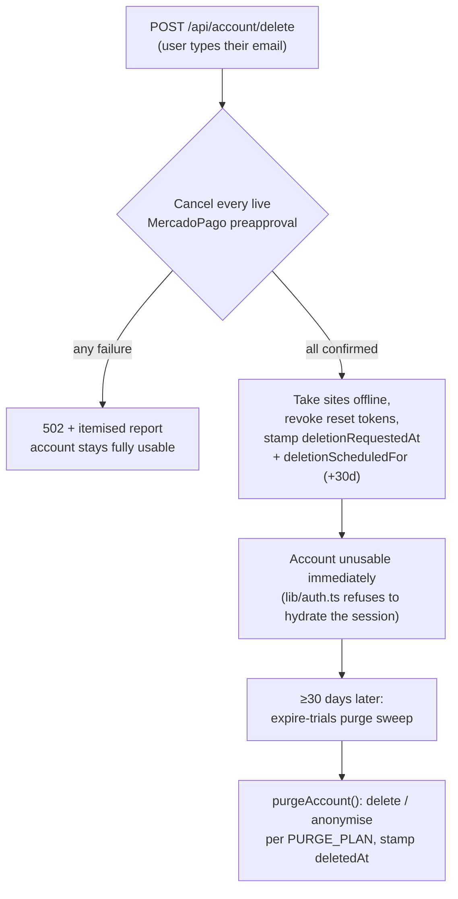

# 5. Admin & operations surface

## Contents
- [The admin panel](#the-admin-panel)
- [Admin auth](#admin-auth)
- [Gifting from the shell (`/root/regalar-sitio.sh`)](#gifting-from-the-shell-rootregalar-sitiosh)
- [Account deletion: the two-phase model](#account-deletion-the-two-phase-model)

## The admin panel

Routes live under `app/(dashboard)/admin/`. All are server components gated by
`requireAdmin()`.

| Route | File | Purpose |
|---|---|---|
| `/admin` | `admin/page.tsx` | **Overview.** Ordered by attention: problem rows first (and only when they exist) → the numbers → one row per customer. Uses `lib/admin-overview.ts`. Budget: ~22 queries/load. |
| `/admin/sitios` | `admin/sitios/` | **Gift / ungift** sites, with **provenance** (`grantedBy`/`grantedAt` vs coupon vs real sale). Backed by `POST/DELETE /api/admin/projects/[id]/gift`. |
| `/admin/negocio` | `admin/negocio/` | Business **drill-down**. |
| `/admin/cupones` | `admin/cupones/` | Coupon management (`/api/admin/coupons`). |
| `/admin/cuentas-gratis` | `admin/cuentas-gratis/` | Free-access accounts (`/api/admin/free-accounts`, `lib/free-account.ts`). |
| `/admin/suscripciones` | `admin/suscripciones/` | Subscriptions across **all 13 products** (`lib/admin-products.ts`). It previously queried only 3 and was blind to the other 10; the product list now exists as data (`ADMIN_PRODUCT_IDS`), so a 14th product is a one-line change. |

**The honesty rule in the overview** (`lib/admin-overview.ts`, `admin/page.tsx`
headers): three things a dashboard would like to show are deliberately **absent**
because the data to compute them honestly does not exist —

1. **Visits over a period** — `Project.views` is a single cumulative counter with no time dimension and no per-visit table. A 30-day figure can't be derived, so none is shown.
2. **Cancellations of the 12 subscription products** — those rows carry `status: 'cancelled'` but no cancellation timestamp (`updatedAt` moves on any write). Only the website generator's cancellations can be dated (`suspendedAt` + `suspendedReason: 'cancelled'`), so `cancellationsThisMonth` counts only those and the label says so.
3. **Churn / retention** — needs (2). Absent.

A zero is never rendered where a number wasn't measured — a grid of zeros is
indistinguishable from a page that failed to load, so when nothing is wrong the
page says so in one line (`isAllClear()`).

## Admin auth

`requireAdmin()` (`lib/admin.ts`):

- Reads the session (`getServerSession`), then checks `isAdminEmail(session.user.email)` against the `ADMIN_EMAILS` allowlist (`lib/admin-emails.ts`, default `automaticialab@gmail.com`). The email is re-read from the session on **every call**, never from a client flag.
- `session.user.isAdmin` (set in `lib/auth.ts`) is a **cosmetic hint only** — it decides whether to render admin navigation. It is **not** an authorization decision and must not be used as one.
- **Non-admins get `notFound()` (404), not 403** — a 403 confirms the panel exists and tells a prober where it lives (`admin/layout.tsx`).
- **Defence in depth:** the layout gates the subtree, **each page re-checks**, and **every `/api/admin/*` route re-checks independently** — a layout is not a reliable authorization boundary on its own.

## Gifting from the shell (`/root/regalar-sitio.sh`)

There is a VPS script `/root/regalar-sitio.sh` for comping a site from the shell.
The in-app equivalent is `POST /api/admin/projects/[id]/gift` (and `DELETE` to
revoke), which does what the script does **plus records who granted it and when**:

- **Gift:** `hasPaid: true`, `plan: 'professional'`, `billingStatus: 'active'`, clears `graceUntil`/`suspendedAt`/`suspendedReason`, sets `grantedBy` (admin email) + `grantedAt`. Publication status is **not** touched — gifting pays for a site, it doesn't publish it; the owner still presses publish.
- **Revoke:** back to `hasPaid: false`, `plan: 'free'`, clears `grantedBy`/`grantedAt`. `status` is **not** touched (the public read path re-derives access from `hasPaid`/`billingStatus`, so unpublishing here would be a divergent second source of truth). Revoking erases the gift record — a permanent audit trail would need an append-only event table (out of scope); the server log line is the interim record.

Provenance matters because `hasPaid` alone cannot distinguish a comped site from
a real sale in a revenue query — the shell script left exactly that ambiguity,
which the `grantedBy`/`grantedAt` columns close.

> ⚠️ **unverified from this repo:** `/root/regalar-sitio.sh` lives on the VPS, not
> in this checkout. Its in-app equivalent and the columns it writes ARE grounded
> (`app/api/admin/projects/[id]/gift/route.ts`).

## Account deletion: the two-phase model

Implemented as **policy-as-code** in `lib/account-deletion.ts` (the `PURGE_PLAN`
constant *is* the reviewable list, not documentation beside it). It honours the
privacy promise in `app/privacy/page.tsx`: personal data deleted within 30 days,
legally-required records retained.

**Phase 1 — on request** (`app/api/account/delete/route.ts`). Order is the entire
design: **billing is stopped BEFORE anything is marked, and marking only happens
if every cancellation was confirmed.** Prove ownership (session) + deliberateness
(typed email must match, `confirmationMatches()`); find every live preapproval
(the generator's `Project.preapprovalId` + all 12 subscription products); cancel
them and write each local status back; **if any cancellation fails, stop with 502
and leave the account usable** — a half-deleted account still being charged is
the one outcome with no defence. Only then take sites offline, revoke
password-reset tokens, and stamp `deletionRequestedAt` + `deletionScheduledFor`.
The account is **blocked the instant those stamps land**: `lib/auth.ts` refuses
to hydrate a session for a user carrying `deletionRequestedAt`
(`isAccountAccessBlocked()`), and every route gates on `session.user.id`.

**Phase 2 — purge after 30 days** (folded into `POST /api/admin/expire-trials`).
`purgeAccount()` runs each account in its **own transaction**; a failure leaves it
still due so the next daily run retries it. Per model, one of:

- **delete** — pure personal data with no financial meaning: `PasswordResetToken`, `Media`, `SiteLead`, `CausasCase`.
- **anonymise** — rows carrying **both** identity and money: identity columns are cleared in place, financial columns survive. **All 12 subscription products, `Project`, `Inquiry`, and `User` are anonymised, never deleted** — hard-deleting `User` would cascade the entire billing trail away (every `Project`/`*Subscription` FKs off `User.id`).

Retained after anonymisation = the **anonymised billing trail**: `plan` (→ amount),
dates, `preapprovalId`, `couponId`, `discountApplied`, provenance.

**The accountant-review note (grounded in the code):**
- Encrypted judicial credentials (`Monitoring`/`Causas` `credential*`/`mev*` blobs) are **destroyed, not retained** — an encrypted secret is still a secret and the key lives in the same deployment.
- **`FacturacionSubscription.cuit`/`razonSocial` identify the *customer's own* taxpayer**, not the platform's, so they are blanked — but the code explicitly **flags for the accountant**: *if local law requires keeping the payer's CUIT, move `cuit`/`razonSocial` out of the blank list.*
- `Inquiry` is anonymised (not deleted) so funnel statistics survive without the person — also **flagged for review** as arguably a commercial record of its own.
- Unique columns (`User.email`, `Turnos.slug`, `Project.subdomain`/`slug`) get non-routable tombstones (`deleted-{id}@deleted.invalid`, RFC-2606 `.invalid`) so they free up for reuse and can never be mailed.
- Uploaded files are unlinked from disk **after** the DB transaction commits (`GET /api/uploads/[filename]` is public and reads straight off disk, so dropping only the `Media` row would leave photos permanently fetchable).
